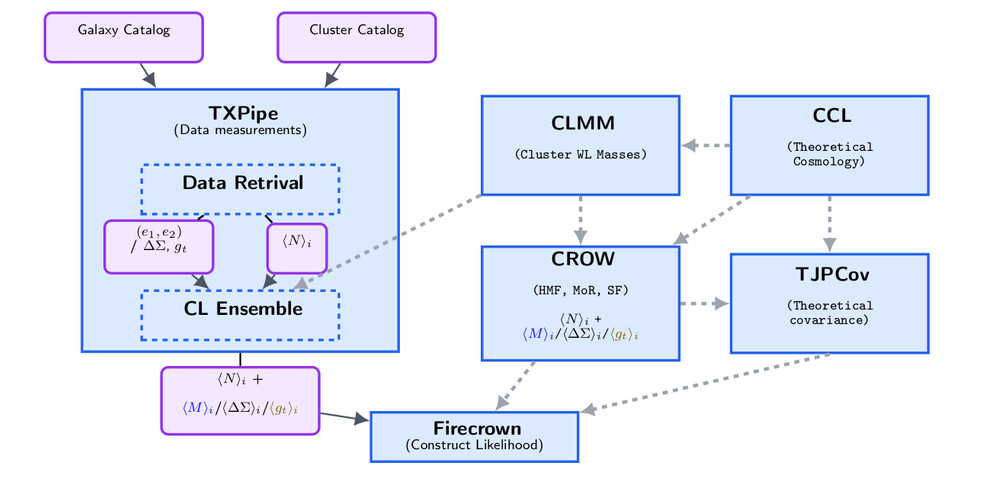

********************************
LSST DESC software dependencies
********************************
This pipeline relies on several Python packages developed by the LSST Dark Energy Science Collaboration (LSST DESC).
It integrates these DESC tools into a unified analysis workflow.
We encourage readers to consult the official documentation for each project; links are provided below.

--------------------------------------------------
 Package dependencies:
--------------------------------------------------

1. CLL
------
DESC Core Cosmology Library: cosmology routines with validated numerical accuracy  

* https://github.com/LSSTDESC/CCL

2. CLMM
---------
The LSST-DESC Cluster Lensing Mass Modeling

* https://github.com/LSSTDESC/CLMM

3. CROW
-------
The LSST-DESC Cluster Reconstruction of Observables Workbench (CROW)

* https://github.com/LSSTDESC/CROW

4. Firecrown
------------
Provides the DESC framework to implement likelihoods

* https://github.com/LSSTDESC/Firecrown

5. TJPCov
---------
A general covariance calculator interface to be used within LSST DESC.

* https://github.com/LSSTDESC/TJPCov

6. TXPipe
---------
 The DESC 3x2pt Pipeline implementation. It measures lensing and clustering 2pt quantities in real and Fourier space

* https://github.com/LSSTDESC/TXPipe
